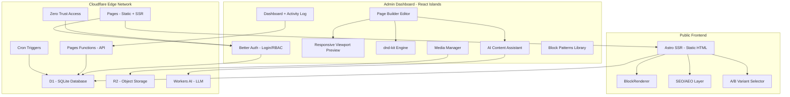
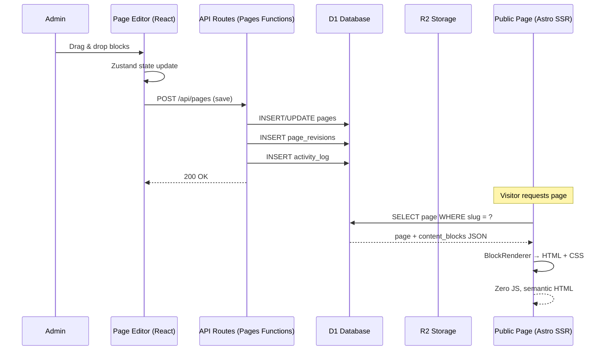
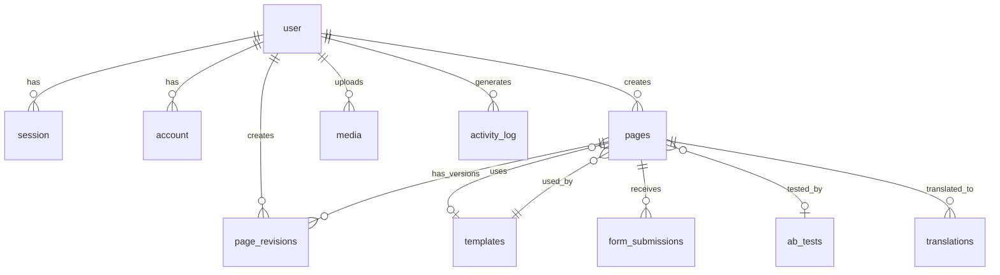
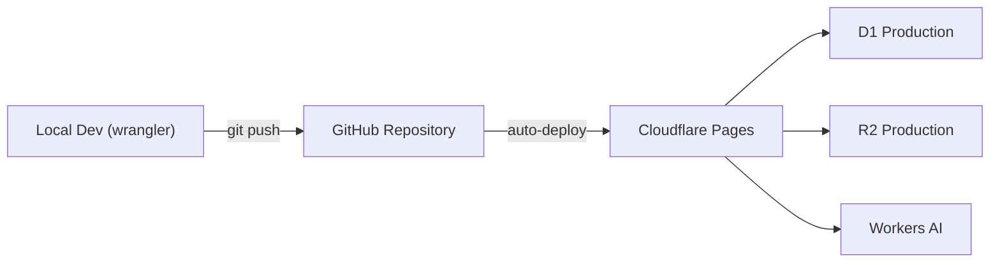

# Aglow Portfolio Builder — Project Overview

> **Version**: 1.0 | **Last Updated**: 2026-02-28  
> **Type**: Corporate Website + Custom Page Builder CMS  
> **License**: Private

---

## 1. Vision & Goals

สร้างเว็บไซต์องค์กรประสิทธิภาพสูง (High-Performance Corporate Website) ที่ Admin สามารถ สร้าง/แก้ไขหน้าเว็บผ่าน Visual Page Builder แบบ Drag & Drop โดยไม่ต้องเขียนโค้ด โดยเน้น:

- **Performance** — Static HTML + zero JS on public pages (Astro SSR)
- **Security** — Better Auth + Cloudflare Access Zero Trust
- **SEO/AEO** — Semantic HTML, JSON-LD, llms.txt, sitemap
- **Developer Experience** — Type-safe ทั้ง stack (TypeScript + Zod + Drizzle)
- **Edge-first** — ทุกอย่างรันบน Cloudflare Edge (D1, R2, Workers AI, Pages)

---

## 2. Tech Stack

| Layer              | Technology                       | Justification                                                  |
| ------------------ | -------------------------------- | -------------------------------------------------------------- |
| **Framework**      | Astro 5 (SSR mode)               | Zero-JS public pages, Islands architecture, Cloudflare adapter |
| **Admin UI**       | React 19 (Islands `client:only`) | State-heavy editor needs client-side reactivity                |
| **UI Library**     | Shadcn UI + Radix Primitives     | Accessible, composable, no vendor lock-in                      |
| **Styling**        | Tailwind CSS 4 + Lucide Icons    | Utility-first, tree-shakeable icons                            |
| **Auth**           | Better Auth                      | RBAC built-in, first-class Astro + D1, edge-native             |
| **Database**       | Cloudflare D1 (SQLite)           | Edge SQL, zero cold-start, free tier generous                  |
| **ORM**            | Drizzle ORM                      | Type-safe, lightweight, D1-optimized                           |
| **Object Storage** | Cloudflare R2                    | S3-compatible, zero egress fees                                |
| **Drag & Drop**    | dnd-kit (next: `@dnd-kit/react`) | Nested containers, grid, keyboard a11y                         |
| **State**          | Zustand                          | Lightweight, no boilerplate, middleware (undo/redo)            |
| **Validation**     | Zod + React Hook Form            | Runtime type-safety, form validation                           |
| **AI**             | Cloudflare Workers AI            | Text gen, SEO suggestions, image alt text                      |
| **Hosting**        | Cloudflare Pages                 | Edge deploy, GitHub CI/CD, free SSL                            |

---

## 3. Architecture



### Data Flow



---

## 4. Database Schema (13 Tables)

### Entity Relationship



### Tables

| #   | Table              | Records              | Key Fields                                                                                |
| --- | ------------------ | -------------------- | ----------------------------------------------------------------------------------------- |
| 1   | `user`             | Admin users          | `id`, `email`, `name`, `role` (admin/editor/author), `image`                              |
| 2   | `session`          | Auth sessions        | `id`, `userId`, `token`, `expiresAt`                                                      |
| 3   | `account`          | OAuth accounts       | `userId`, `provider`, `providerAccountId`                                                 |
| 4   | `verification`     | Email verify tokens  | `identifier`, `value`, `expiresAt`                                                        |
| 5   | `pages`            | All web pages        | `title`, `slug`, `status`, `content_blocks` (JSON), `scheduled_at`, `seo_*`, `custom_css` |
| 6   | `page_revisions`   | Version history      | `page_id`, `content_blocks`, `revision_number`, `note`                                    |
| 7   | `templates`        | Templates + patterns | `name`, `content_blocks`, `category`, `is_pattern`                                        |
| 8   | `media`            | R2 file metadata     | `url`, `r2_key`, `alt_text`, `mime_type`, `width`, `height`                               |
| 9   | `site_settings`    | Global config        | `key`, `value` (JSON) — logo, theme, design tokens                                        |
| 10  | `form_submissions` | Form responses       | `form_block_id`, `page_id`, `data` (JSON)                                                 |
| 11  | `ab_tests`         | A/B experiments      | `page_id`, `variants` (JSON), `traffic_split`, `results`                                  |
| 12  | `activity_log`     | Audit trail          | `user_id`, `action`, `entity_type`, `entity_id`, `metadata`                               |
| 13  | `translations`     | i18n content         | `page_id`, `locale`, `title`, `slug`, `content_blocks`                                    |

---

## 5. Block System — 17 Types

### Block Interface

```typescript
interface Block {
  id: string; // nanoid
  type: BlockType; // discriminated union
  props: Record<string, any>; // type-specific
  children?: Block[]; // nested (container, columns, tabs)
  styles: StyleConfig; // all responsive
  visibility: ResponsiveValue<boolean>; // show/hide per viewport
  customCSS?: string; // scoped escape hatch
}

interface ResponsiveValue<T> {
  desktop: T; // ≥1024px, required
  tablet?: T; // 768-1023px, optional override
  mobile?: T; // <768px, optional override
}
```

### Block Catalog

| Category        | Block         | Description                                         |
| --------------- | ------------- | --------------------------------------------------- |
| **Layout**      | `container`   | Flex/Grid wrapper, nesting support                  |
|                 | `columns`     | 2-6 columns, responsive stacking                    |
|                 | `spacer`      | Adjustable vertical spacing                         |
|                 | `divider`     | Horizontal line separator                           |
| **Content**     | `text`        | Rich text (headings, paragraphs, lists, links)      |
|                 | `image`       | Image + caption + link, responsive sizing           |
|                 | `video`       | YouTube/Vimeo embed, aspect ratio control           |
|                 | `code`        | Syntax-highlighted code block (Shiki)               |
| **Section**     | `hero`        | Full-width hero with bg image/video + overlay + CTA |
|                 | `cta`         | Call-to-action button with variants                 |
|                 | `icon-box`    | Lucide icon + title + description card              |
|                 | `testimonial` | Quote card with author info                         |
| **Interactive** | `accordion`   | Collapsible FAQ items                               |
|                 | `tabs`        | Tabbed panels with nested blocks                    |
|                 | `form`        | Dynamic form fields → D1 + email                    |
|                 | `map`         | Google Maps embed                                   |
| **Dynamic**     | `query-loop`  | Render content from DB queries                      |

---

## 6. Feature Summary

### Core Features

| Feature                | Description                                                                |
| ---------------------- | -------------------------------------------------------------------------- |
| **Page Builder**       | 3-panel editor: Sidebar (blocks/tree/layers) + Canvas (DnD) + Properties   |
| **Responsive Preview** | Switch viewport (🖥️1440 / 💻768 / 📱375) with per-breakpoint style editing |
| **Block Visibility**   | Show/hide specific blocks per viewport                                     |
| **Undo/Redo**          | 50-step history stack + keyboard shortcuts                                 |
| **Auto-save**          | Draft save every 30s with indicator                                        |
| **Content Versioning** | Revision history with browse, compare, and restore                         |
| **Media Manager**      | Client-side WebP compression → R2, library with picker modal               |
| **RBAC**               | Admin / Editor / Author roles via Better Auth                              |

### Advanced Features

| Feature                  | Description                                                             |
| ------------------------ | ----------------------------------------------------------------------- |
| **Block Patterns**       | Save reusable block groups, pattern library                             |
| **Live Preview**         | SSR iframe preview with unsaved data                                    |
| **Scheduled Publishing** | Set future publish date, Cron auto-publish                              |
| **Form Builder**         | Dynamic forms → D1 submissions + email notification                     |
| **Global Styles**        | Design tokens (colors, fonts, spacing) — change once, update everywhere |
| **Custom CSS**           | Per-block CSS escape hatch, scoped                                      |
| **AI Assistant**         | Workers AI: generate text, SEO suggestions, alt text                    |
| **A/B Testing**          | Page variants, traffic split, cookie-based tracking                     |
| **Export/Import**        | Page JSON backup, migration, template sharing                           |
| **Activity Log**         | Full audit trail of all admin actions                                   |
| **Keyboard Shortcuts**   | Power user productivity (save, undo, duplicate, navigate, viewport)     |

### SEO/GEO/AEO

| Feature | Description                                                             |
| ------- | ----------------------------------------------------------------------- |
| **SEO** | Per-page title, description, OG image, canonical URL, sitemap.xml       |
| **GEO** | Multilingual (translations table), hreflang, locale routing             |
| **AEO** | JSON-LD (Organization, LocalBusiness, Article), llms.txt, semantic HTML |

---

## 7. Project Structure

```
portfolio-builder/
├── astro.config.mjs             # Astro: SSR, Cloudflare, React, Sitemap
├── auth.ts                      # Better Auth server config
├── wrangler.toml                # D1/R2/AI/Cron bindings
├── drizzle.config.ts            # Drizzle → D1
├── drizzle/migrations/          # SQL migration files
├── public/
│   ├── robots.txt
│   └── llms.txt
├── src/
│   ├── db/
│   │   ├── schema.ts            # Drizzle table definitions (13 tables)
│   │   └── client.ts            # D1 → Drizzle instance helper
│   ├── lib/
│   │   ├── auth-client.ts       # Better Auth React client
│   │   ├── r2.ts                # R2 upload/delete utilities
│   │   ├── blocks.ts            # Block Zod schemas (17 types)
│   │   ├── global-styles.ts     # Design token definitions
│   │   └── ai-assistant.ts      # Workers AI API helpers
│   ├── middleware.ts             # Auth session + RBAC route guard
│   ├── pages/
│   │   ├── index.astro          # Home page
│   │   ├── [slug].astro         # Dynamic page renderer
│   │   ├── api/                 # API routes (Pages Functions)
│   │   │   ├── auth/[...all].ts
│   │   │   ├── pages/           # CRUD + revisions + schedule
│   │   │   ├── media/upload.ts
│   │   │   ├── users/
│   │   │   ├── settings/
│   │   │   ├── templates/       # Block patterns CRUD
│   │   │   ├── forms/           # Form submission handlers
│   │   │   ├── ai/              # AI generation endpoints
│   │   │   ├── ab-tests/        # A/B test management
│   │   │   ├── export/          # Export/Import handlers
│   │   │   └── activity/        # Activity log query
│   │   └── admin/               # Admin SPA pages
│   │       ├── index.astro
│   │       ├── pages/
│   │       ├── media.astro
│   │       ├── templates.astro
│   │       ├── forms.astro
│   │       ├── users.astro
│   │       ├── settings.astro
│   │       └── ab-tests.astro
│   ├── components/
│   │   ├── astro/               # Public (SSR, zero JS)
│   │   │   ├── BlockRenderer.astro
│   │   │   ├── SEOHead.astro
│   │   │   ├── Header.astro
│   │   │   └── Footer.astro
│   │   └── react/               # Admin (React Islands)
│   │       ├── editor/          # Page Builder editor panels
│   │       ├── blocks/          # 17 block edit components
│   │       ├── media/           # Media library + uploader
│   │       └── ui/              # Shadcn UI primitives
│   ├── stores/
│   │   └── editor-store.ts      # Zustand: blocks + history + viewport
│   └── styles/
│       └── global.css           # Tailwind base + design tokens
├── package.json
└── tsconfig.json
```

---

## 8. Non-Functional Requirements

| Requirement              | Target                 |
| ------------------------ | ---------------------- |
| Lighthouse Performance   | ≥ 90                   |
| Lighthouse SEO           | ≥ 90                   |
| Lighthouse Accessibility | ≥ 90                   |
| First Contentful Paint   | < 1.5s                 |
| Time to Interactive      | < 2.5s                 |
| Bundle size (public)     | 0 KB JS (SSR only)     |
| Build time               | < 60s                  |
| API response (p95)       | < 200ms (edge)         |
| D1 query (p95)           | < 50ms                 |
| Uptime                   | 99.9% (Cloudflare SLA) |

---

## 9. Deployment



- **Local**: `wrangler` emulates D1/R2 locally
- **CI/CD**: GitHub push → Cloudflare Pages auto-build + deploy
- **Migrations**: `drizzle-kit generate` → `wrangler d1 migrations apply`
- **Env vars**: Cloudflare Dashboard (D1 ID, R2 bucket, AI token)
