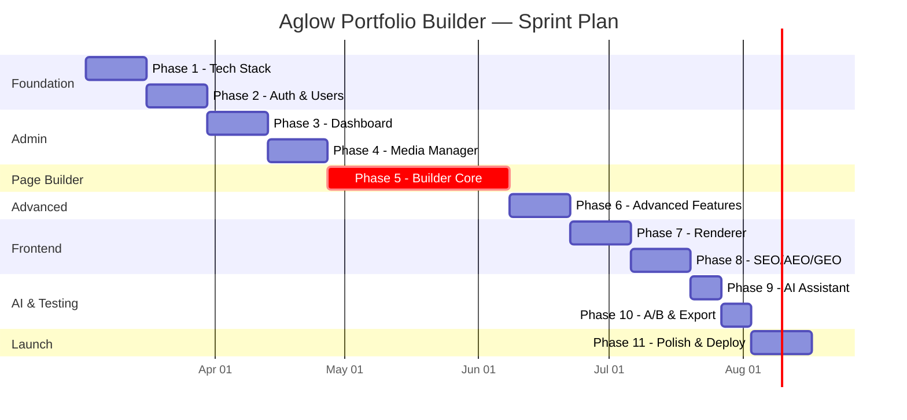

# Aglow Portfolio Builder — Development Tasks

> แผนงานพัฒนาพร้อมหลักการเขียน Clean Code  
> วิเคราะห์โดย Senior Full-stack Developer  
> **Sprint Plan**: 24 weeks / 11 sprints

---

## Clean Code Principles — หลักการเขียนที่ใช้ทั้งโปรเจ็ค

### 1. Architecture Principles

```
src/
├── db/          → Data Layer (Schema + Client)
├── lib/         → Business Logic (Pure functions, no side effects)
├── middleware.ts → Cross-cutting Concerns (Auth, Logging)
├── pages/api/   → Thin Controllers (validate → delegate → respond)
├── components/  → UI Layer (Presentational + Container pattern)
└── stores/      → State Management (Single source of truth)
```

**Separation of Concerns** — แต่ละ layer มีหน้าที่เดียว:

- `db/` → ยุ่งกับ database เท่านั้น ไม่มี business logic
- `lib/` → pure functions, testable, ไม่ import framework-specific code
- `pages/api/` → validate input → เรียก lib → return response (ไม่มี logic ซับซ้อน)
- `components/` → render UI, ไม่เรียก API ตรง (ผ่าน store/hooks)

### 2. Naming Conventions

```typescript
// ✅ Files: kebab-case
src/lib/global-styles.ts
src/components/react/editor/viewport-toolbar.tsx

// ✅ Components: PascalCase
export function ViewportToolbar() {}
export function BlockRenderer() {}

// ✅ Functions: camelCase, verb-first, descriptive
function createPageRevision(pageId: string, note?: string) {}
function validateBlockSchema(block: unknown): Block {}
function mergeResponsiveStyles(styles: StyleConfig, viewport: Viewport) {}

// ✅ Constants: SCREAMING_SNAKE_CASE
const MAX_HISTORY_SIZE = 50
const VIEWPORT_WIDTHS = { desktop: 1440, tablet: 768, mobile: 375 }
const AUTOSAVE_INTERVAL_MS = 30_000

// ✅ Types/Interfaces: PascalCase, noun-based
interface PageRevision {}
type BlockType = 'container' | 'text' | ...
type Viewport = 'desktop' | 'tablet' | 'mobile'

// ✅ Booleans: is/has/can/should prefix
const isDirty = true
const hasChildren = block.children?.length > 0
const canPublish = user.role === 'admin' || user.role === 'editor'

// ❌ Anti-patterns
function data() {}          // → ไม่บอกว่าทำอะไร
function handleClick() {}   // → handleBlockDelete() ชัดเจนกว่า
const x = 50               // → const maxHistorySize = 50
```

### 3. Function Design

```typescript
// ✅ Single Responsibility — ฟังก์ชันทำสิ่งเดียว
function hashPassword(plain: string): Promise<string> { ... }
function verifyPassword(plain: string, hash: string): Promise<boolean> { ... }
function createSession(userId: string): Promise<Session> { ... }

// ❌ God Function — ทำทุกอย่างในฟังก์ชันเดียว
function loginUser(email, password) {
  // hash + verify + create session + set cookie + log activity
  // → แยกเป็น 5 ฟังก์ชัน compose กัน
}

// ✅ Early Return — ลด nesting, อ่านง่าย
async function getPage(slug: string) {
  const page = await db.query.pages.findFirst({ where: eq(pages.slug, slug) })
  if (!page) return null
  if (page.status !== 'published') return null
  return page
}

// ✅ Parameter Object — ≥3 params → ใช้ object
function createBlock(opts: { type: BlockType; parentId?: string; position?: number }) {}

// ✅ Pure Functions ใน lib/ — ไม่มี side effect, testable
function mergeStyles(base: StyleConfig, viewport: Viewport): CSSProperties {
  const desktop = base.margin.desktop
  const override = base.margin[viewport]
  return override ?? desktop
}
```

### 4. Error Handling

```typescript
// ✅ Custom Error Classes
class AppError extends Error {
  constructor(
    message: string,
    public statusCode: number,
    public code: string,
  ) {
    super(message);
  }
}

class NotFoundError extends AppError {
  constructor(entity: string, id: string) {
    super(`${entity} with id ${id} not found`, 404, "NOT_FOUND");
  }
}

class ForbiddenError extends AppError {
  constructor(action: string) {
    super(`Insufficient permissions for: ${action}`, 403, "FORBIDDEN");
  }
}

// ✅ API Route Pattern — consistent error responses
export async function POST({ request, locals }: APIContext) {
  try {
    const body = pageSchema.parse(await request.json()); // Zod validates
    const result = await createPage(locals.db, body, locals.user);
    return Response.json({ success: true, data: result }, { status: 201 });
  } catch (error) {
    if (error instanceof ZodError) {
      return Response.json(
        { success: false, errors: error.flatten() },
        { status: 400 },
      );
    }
    if (error instanceof AppError) {
      return Response.json(
        { success: false, error: error.message },
        { status: error.statusCode },
      );
    }
    console.error("Unexpected error:", error);
    return Response.json(
      { success: false, error: "Internal server error" },
      { status: 500 },
    );
  }
}
```

### 5. Type Safety

```typescript
// ✅ Zod → Drizzle → TypeScript — single source of truth
// 1. Define Zod schema (runtime validation)
const blockSchema = z.object({
  id: z.string(),
  type: z.enum(['container', 'text', 'image', ...]),
  props: z.record(z.any()),
  children: z.lazy(() => z.array(blockSchema)).optional(),
  styles: styleConfigSchema,
  visibility: responsiveValueSchema(z.boolean()),
})

// 2. Infer TypeScript type (compile-time safety)
type Block = z.infer<typeof blockSchema>

// 3. Drizzle schema uses same types
const pages = sqliteTable('pages', {
  contentBlocks: text('content_blocks').$type<Block[]>(),
})

// ✅ Discriminated Union for Block Props
type TextBlockProps = { content: string; level: 'h1' | 'h2' | 'h3' | 'p' }
type ImageBlockProps = { mediaId: string; alt: string; caption?: string }

type BlockProps =
  | { type: 'text'; props: TextBlockProps }
  | { type: 'image'; props: ImageBlockProps }
  // ... exhaustive switch-case ตรวจสอบ compile-time
```

### 6. Component Patterns

```typescript
// ✅ Container/Presentational Pattern
// Container: handles data, state, side effects
function PageEditorContainer({ pageId }: { pageId: string }) {
  const { loadPage, blocks, savePage } = useEditorStore()
  useEffect(() => { loadPage(pageId) }, [pageId])
  return <PageEditorView blocks={blocks} onSave={savePage} />
}

// Presentational: pure render, receives props
function PageEditorView({ blocks, onSave }: PageEditorViewProps) {
  return (
    <div className="editor-layout">
      <Sidebar />
      <Canvas blocks={blocks} />
      <PropertiesPanel />
    </div>
  )
}

// ✅ Composition over Inheritance
// ไม่สร้าง BaseBlock class แล้ว extend
// ใช้ composition: BlockWrapper + specific block content
function BlockWrapper({ block, children }: { block: Block; children: ReactNode }) {
  const { selectedBlockId, selectBlock } = useEditorStore()
  const isSelected = selectedBlockId === block.id
  return (
    <div
      className={cn('block-wrapper', isSelected && 'selected')}
      onClick={() => selectBlock(block.id)}
    >
      {children}
      {isSelected && <BlockToolbar blockId={block.id} />}
    </div>
  )
}
```

### 7. State Management Rules

```typescript
// ✅ Zustand: Immutable updates, single store per domain
const useEditorStore = create<EditorStore>((set, get) => ({
  blocks: [],
  history: [],
  future: [],

  // ✅ Always push history before mutation
  addBlock: (type, parentId, position) => {
    get().pushHistory();
    set((state) => ({
      blocks: insertBlock(state.blocks, createBlock(type), parentId, position),
      isDirty: true,
    }));
  },

  // ✅ Undo/Redo — swap stacks
  undo: () =>
    set((state) => {
      if (state.history.length === 0) return state;
      const previous = state.history[state.history.length - 1];
      return {
        blocks: previous,
        history: state.history.slice(0, -1),
        future: [state.blocks, ...state.future],
      };
    }),
}));

// ❌ Anti-pattern: mutating state directly
// set((state) => { state.blocks.push(newBlock) }) → ใช้ spread/slice แทน
```

### 8. Testing Strategy

```
Unit Tests (Vitest)
├── lib/blocks.test.ts        → Zod schema validation
├── lib/global-styles.test.ts → Style merging logic
├── lib/r2.test.ts            → R2 helper functions
└── stores/editor-store.test.ts → Zustand actions + undo/redo

Integration Tests (Vitest + Miniflare)
├── api/pages.test.ts         → CRUD + revisions + schedule
├── api/media.test.ts         → Upload flow
├── api/auth.test.ts          → Login, session, RBAC
└── api/forms.test.ts         → Form submission

E2E Tests (Manual / Playwright future)
├── Login flow
├── Page Builder drag & drop
├── Responsive viewport switch
└── Publish + verify frontend
```

---

## Phase 1: Foundation & Tech Stack (Week 1-2)

### Tasks

- [x] **1.1 Initialize Astro project with integrations**
  - `npx astro add react cloudflare sitemap`
  - Configure `astro.config.mjs`: `output: 'server'`, Cloudflare adapter
  - Verify `npm run dev` works with React island rendering

- [x] **1.2 Setup Cloudflare bindings**
  - Create `wrangler.toml` with D1, R2, AI, Cron bindings
  - Create D1 database: `npx wrangler d1 create portfolio-builder-db`
  - Create R2 bucket: `npx wrangler r2 bucket create portfolio-media`
  - Verify local emulation: `npx wrangler dev`

- [x] **1.3 Setup Drizzle ORM**
  - Install `drizzle-orm` + `drizzle-kit`
  - Create `drizzle.config.ts` pointing to D1 local file
  - Create `src/db/client.ts` — helper ที่รับ D1 binding แล้วคืน Drizzle instance

- [x] **1.4 Define all database schemas**
  - Create `src/db/schema.ts` — 13 tables ทั้งหมด
  - Run `npx drizzle-kit generate` → สร้าง SQL migrations
  - Apply: `npx wrangler d1 migrations apply portfolio-builder-db --local`
  - **Clean Code**: ใช้ Drizzle `$type<>()` สำหรับ JSON columns เพื่อ type safety

- [x] **1.5 Install all dependencies**
  - Core, Admin UI, DnD, State, Storage packages ตาม dependency list
  - Setup Shadcn UI: `cn()` utility, base components (Button, Dialog, Input, etc.)

- [x] **1.6 Setup project conventions**
  - `tsconfig.json`: strict mode, path aliases (`@/components`, `@/lib`, `@/db`)
  - `.eslintrc`: enforce naming conventions
  - `.prettierrc`: consistent formatting
  - Git hooks: lint-staged + Husky (optional)

### หลักการ Clean Code เฉพาะ Phase นี้

> **Foundation determines everything** — schema ที่ออกแบบดีตั้งแต่แรก = ไม่ต้อง refactor ทั้งโปรเจ็คทีหลัง
>
> - `schema.ts` ต้องเป็น Single Source of Truth สำหรับ DB types
> - ทุก JSON column ต้องมี Zod schema + TypeScript type คู่กัน
> - D1 client helper ต้อง abstract binding access ไม่ให้ component เข้าถึง `runtime.env` ตรง

---

## Phase 2: Authentication & User Management (Week 3-4)

### Tasks

- [x] **2.1 Configure Better Auth server**
  - Create `auth.ts` with Drizzle adapter (SQLite provider)
  - Enable email/password + session cookie caching
  - Add custom `role` field to user schema
  - **Clean Code**: auth config เป็น declarative ไม่มี imperative logic

- [x] **2.2 Setup API catch-all route**
  - `src/pages/api/auth/[...all].ts` → delegate ให้ Better Auth handler
  - **Clean Code**: thin controller — 1 line delegation, ไม่มี logic ใน route file

- [x] **2.3 Create auth middleware**
  - `src/middleware.ts`: validate session → inject `user` + `db` ลง `Astro.locals`
  - Route protection: `/admin/*` → redirect `/admin/login` ถ้าไม่มี session
  - RBAC guard: check `user.role` สำหรับ sensitive operations
  - **Clean Code**: middleware ทำ 3 อย่างเท่านั้น: authenticate, authorize, inject context

- [x] **2.4 Create auth client helpers**
  - `src/lib/auth-client.ts`: `signIn()`, `signOut()`, `useSession()` hooks
  - **Clean Code**: wrap Better Auth client ด้วย project-specific interface → ถ้าเปลี่ยน auth library ในอนาคต แก้ไฟล์เดียว (Adapter Pattern)

- [x] **2.5 Build User Management UI**
  - Users table with role badges + actions
  - Create/Edit user modal (React Hook Form + Zod)
  - Role selector (Admin / Editor / Author)
  - Delete confirmation dialog
  - **Clean Code**: แยก data fetching (hook) ออกจาก UI (component)

- [x] **2.6 Implement Activity Log**
  - Create `logActivity()` utility function
  - Integrate into middleware: auto-log on POST/PUT/DELETE
  - Dashboard: activity feed component (recent 20 items)
  - **Clean Code**: logging เป็น cross-cutting concern → ใส่ใน middleware ไม่ใช่ในแต่ละ route

### หลักการ Clean Code เฉพาะ Phase นี้

> **Security never compromises readability** — auth code ต้องอ่านง่ายเพราะ security bugs มาจากโค้ดที่ซับซ้อน
>
> - Middleware ไม่เกิน 50 บรรทัด
> - RBAC check ใช้ lookup table ไม่ใช่ nested if-else
> - Password handling อยู่ใน Better Auth ไม่ต้องเขียนเอง → ลดโอกาสผิดพลาด

---

## Phase 3: Admin Dashboard & Settings (Week 5-6)

### Tasks

- [x] **3.1 Create AdminLayout**
  - `src/layouts/AdminLayout.astro`: sidebar + header + main content area
  - Sidebar: collapsible, active state highlight, icon + label
  - Header: user avatar, role badge, logout button
  - Responsive: sidebar overlay on mobile
  - **Clean Code**: layout เป็น pure Astro component, ไม่มี data fetching (รับ props จาก page)

- [x] **3.2 Build Dashboard page**
  - Stats cards: pages count, media count, users count, form submissions
  - Recent activity feed (from `activity_log`)
  - Quick action buttons (New Page, Upload Media)
  - **Clean Code**: แต่ละ stat card เป็น component แยก, data fetch ที่ page level ผ่าน Astro

- [x] **3.3 Build Site Settings UI**
  - Site Identity tab: name, logo (media picker), favicon, tagline
  - Social Links tab: dynamic add/remove/reorder
  - All persisted as JSON in `site_settings` table (key-value)
  - **Clean Code**: settings form ใช้ generic `SettingsForm<T>` component → reuse schema

- [x] **3.4 Implement Global Styles System**
  - Design tokens stored in `site_settings` (key: `design_tokens`)
  - Colors: primary, secondary, accent, background, text, muted
  - Typography: heading font, body font (Google Fonts URL), size scale
  - Spacing: base unit (4px/8px), scale multiplier
  - Live preview panel: shows token changes in real-time
  - Export to CSS custom properties: `--color-primary: #xxx`
  - **Clean Code**: tokens defined as Zod schema → validate before save → generate CSS → inject into `<head>`

### หลักการ Clean Code เฉพาะ Phase นี้

> **Configuration as Data** — settings ทั้งหมดเป็น JSON ที่ validate ด้วย Zod
>
> - ไม่ hardcode ค่าใดๆ ในโค้ด — ทุกอย่างอ่านจาก `site_settings`
> - Design tokens เป็น CSS custom properties → blocks อ้างอิง `var(--color-primary)` ไม่ใช่ `#3B82F6`
> - Settings cache: โหลดครั้งเดียวต่อ request → inject เข้า layout

---

## Phase 4: Media Manager (Week 7-8)

### Tasks

- [x] **4.1 Create R2 upload utility**
  - `src/lib/r2.ts`: `uploadFile()`, `deleteFile()`, `getPublicUrl()`
  - Accept: images (jpg, png, webp, gif, svg), videos (mp4, webm), documents (pdf)
  - Generate unique R2 key: `media/{year}/{month}/{nanoid}.{ext}`
  - **Clean Code**: pure utility functions, no state, no framework dependency

- [x] **4.2 Create upload API route**
  - `POST /api/media/upload`: multipart form → validate → upload R2 → save metadata D1
  - Client-side: compress + convert to WebP before upload (browser-image-compression)
  - Max file size: 10MB (configurable)
  - Return: `{ id, url, width, height }`
  - **Clean Code**: validation → transformation → persistence — clear pipeline

- [x] **4.3 Build Media Library UI**
  - Grid layout with lazy-loaded thumbnails
  - Search by filename, filter by mime type
  - Inline edit: alt text, rename
  - Delete with confirmation (removes from R2 + D1)
  - Pagination or infinite scroll

- [x] **4.4 Build Media Picker Modal**
  - Reusable modal component for selecting media from editor
  - Shows Media Library inside dialog
  - "Upload new" tab inside picker
  - Returns selected media object to caller
  - **Clean Code**: Modal ใช้ render props / callback pattern → decouple จาก editor logic

### หลักการ Clean Code เฉพาะ Phase นี้

> **Separation**: upload logic (lib) ≠ API route (controller) ≠ UI (component)
>
> - R2 utility ไม่รู้จัก Astro, React, หรือ D1 → testable in isolation
> - Image compression อยู่ฝั่ง client เท่านั้น → ลด server load
> - Media picker เป็น generic → ใช้ได้ทั้งใน editor, settings, user avatar

---

## Phase 5: Page Builder Core (Week 9-14)

### Tasks

- [x] **5.1 Define Block Schemas (Zod)**
  - Create `src/lib/blocks.ts`: 17 block type schemas
  - `ResponsiveValue<T>` generic for per-breakpoint values
  - `StyleConfig` with responsive margin, padding, display, etc.
  - `Block` interface with discriminated union props
  - Validation: `blockSchema.parse()` ก่อนทุก save
  - **Clean Code**: schema เป็น Single Source of Truth → infer TypeScript types จาก Zod

- [x] **5.2 Create Zustand Editor Store**
  - `src/stores/editor-store.ts`: blocks, history, viewport, selected
  - Immutable state updates (spread, not mutate)
  - History middleware: `pushHistory()` before every mutation
  - Max 50 history entries (ring buffer)
  - **Clean Code**: store มี actions + selectors, ไม่มี side effects (API calls เป็น async thunk แยก)

- [x] **5.3 Build Editor Layout (PageEditor.tsx)**
  - 3-panel: Sidebar (280px) | Canvas (flex) | Properties (320px)
  - Top toolbar: Save, Undo, Redo, Viewport, AI, Preview, Publish
  - Status bar: save state, slug, status, revision number
  - **Clean Code**: layout component ไม่มี business logic — เป็น composition ของ sub-components

- [x] **5.4 Build Sidebar**
  - Block Palette tab: draggable block type cards (icon + label)
  - Page Tree tab: outline view of block hierarchy
  - Layers tab: reorder blocks, toggle visibility
  - **Clean Code**: แต่ละ tab เป็น component แยก, shared interface สำหรับ block selection

- [x] **5.5 Integrate dnd-kit (Canvas)**
  - Setup `@dnd-kit/react` with sortable + droppable
  - Canvas as drop zone for new blocks (from sidebar)
  - Sortable blocks within same level
  - Nested DnD: drop into containers/columns/tabs
  - Visual indicators: drop line, hover highlight, selection outline
  - **Clean Code**: DnD logic อยู่ใน custom hooks (`useDndEditor`, `useDropZone`), ไม่ mix กับ render logic

- [x] **5.6 Build Properties Panel**
  - Dynamic form based on `block.type` → render correct fields
  - Content tab: type-specific props (text content, image source, etc.)
  - Style tab: responsive margin/padding/colors → edit per viewport
  - Advanced tab: custom CSS, visibility toggles, HTML attributes
  - **Clean Code**: ใช้ registry pattern → `blockPropertyRegistry[block.type]` → returns correct form component

- [x] **5.7 Implement Responsive Viewport Preview**
  - `ViewportToolbar.tsx`: 3 buttons (🖥️💻📱)
  - Canvas width transitions: 1440px → 768px → 375px (animated)
  - Properties Panel syncs to active viewport
  - Style edits save to correct breakpoint (`styles.tablet.*`)
  - Hidden blocks rendered as ghost (30% opacity + badge)
  - **Clean Code**: viewport state ใน Zustand, ไม่ใน local component state → share across panels

- [x] **5.8 Implement Undo/Redo**
  - History stack: push snapshot before every block mutation
  - `Ctrl+Z` / `Ctrl+Shift+Z` keyboard shortcuts
  - Toolbar buttons with disabled state when stack empty
  - **Clean Code**: undo/redo เป็น Zustand middleware → แยกจาก block logic ทั้งหมด

- [x] **5.9 Implement Auto-save**
  - Debounced save: 30s after last change
  - "Saving..." / "Saved" / "Unsaved" status indicator
  - Save as draft (ไม่ publish)
  - **Clean Code**: auto-save เป็น `useEffect` hook แยก → ไม่ผูกกับ editor logic

- [x] **5.10 Implement Keyboard Shortcuts**
  - Global shortcut handler (event delegation)
  - Save, Undo, Redo, Duplicate, Delete, Navigate, Viewport switch, Deselect
  - **Clean Code**: shortcut map เป็น declarative config object → ง่ายต่อการเพิ่ม/แก้ไข

- [x] **5.11 Build all 17 Block Components**
  - แต่ละ block: edit mode component + Zod schema + default props factory
  - Container/Columns: nested DnD support
  - Text: inline editable with formatting toolbar
  - Image: media picker integration
  - Form: dynamic field builder
  - **Clean Code**: ทุก block follow เดียวกัน → `BlockComponent`, `blockSchema`, `createDefaultProps()`

### หลักการ Clean Code เฉพาะ Phase นี้

> **ส่วนที่ซับซ้อนที่สุดของโปรเจ็ค** — ต้องเข้มงวดเป็นพิเศษ:
>
> - **Block Schema = Contract** — เปลี่ยน schema ต้อง migrate data ดังนั้นออกแบบดีตั้งแต่แรก
> - **DnD logic ห้ามรั่วไหล** — เก็บไว้ใน hooks, Canvas component เห็นแค่ `onDrop` callback
> - **Viewport-aware editing** — ทุกการ update style ต้องผ่าน `updateBlockStyles(id, viewport, styles)` ไม่ set ตรง
> - **Block registry pattern** — เพิ่ม block type ใหม่ = เพิ่ม 1 file + register → ไม่ต้องแก้ไฟล์อื่น (Open/Closed Principle)
> - **Test block schemas** — ทุก block type ต้องมี Vitest: valid JSON passes, invalid JSON fails with clear error

---

## Phase 6: Advanced Builder Features (Week 15-16)

### Tasks

- [x] **6.1 Content Versioning**
  - Auto-create revision on manual save (insert into `page_revisions`)
  - Revision list UI: timeline view, who + when + optional note
  - Restore revision: load old `content_blocks` → replace current
  - Limit: keep last 50 revisions per page
  - **Clean Code**: `createRevision()` เป็น pure function ใน `lib/` → call จาก save API

- [x] **6.2 Block Patterns**
  - "Save as Pattern" action: serialize selected blocks → store in `templates` (is_pattern=true)
  - Pattern Library panel in Sidebar
  - Insert pattern: deep clone blocks (new IDs) → insert at position
  - Category filter + search
  - **Clean Code**: clone ใช้ `structuredClone()` + regenerate IDs → immutable, no reference bugs

- [x] **6.3 Live Preview**
  - Preview button → opens modal/panel with `<iframe>`
  - POST current blocks to `/api/pages/preview` → SSR render → return HTML
  - Auto-refresh on block change (debounced 1s)
  - **Clean Code**: preview API เป็น read-only, ไม่แก้ DB → safe to call repeatedly

- [x] **6.4 Scheduled Publishing**
  - Publish dropdown: "Publish Now" / "Schedule for..."
  - DateTime picker → save `scheduled_at` + set status = `scheduled`
  - Cloudflare Cron Trigger (every 1 min): query `scheduled_at <= now()` → update status to `published`
  - **Clean Code**: cron handler เป็น pure query + update → no complex logic, idempotent

- [x] **6.5 Form Builder Block**
  - Field definition UI: add/remove/reorder fields (text, email, textarea, select, checkbox)
  - Required/optional per field
  - Submit API: `/api/forms/submit` → validate fields → insert `form_submissions`
  - Admin: submissions table per form, export CSV
  - Optional: email notification via Cloudflare Email Workers / webhook
  - **Clean Code**: form schema stored in block props → validate submissions against it at runtime (dynamic Zod)

- [x] **6.6 Custom CSS per Block**
  - `customCSS` textarea in Advanced tab
  - Scoped via unique class: `.block-{id} { ... }`
  - Syntax hint / basic validation (catch unclosed braces)
  - Injected as `<style>` in both editor (preview) and renderer (production)
  - **Clean Code**: CSS scoping ป้องกัน leak → sanitize input to prevent XSS via CSS injection

### หลักการ Clean Code เฉพาะ Phase นี้

> **Feature additions must not break existing code** (Open/Closed Principle)
>
> - Versioning: เพิ่ม `saveAsRevision()` เรียกจาก existing `savePage()` → ไม่แก้ save logic
> - Patterns: ใช้ `templates` table ที่มีอยู่แล้ว + `is_pattern` flag → ไม่สร้างตารางใหม่
> - Scheduled publishing: เพิ่ม `scheduled_at` field ที่ plan ไว้แล้ว + cron handler แยก file

---

## Phase 7: Frontend Renderer (Week 17-18)

### Tasks

- [x] **7.1 Build BlockRenderer.astro**
  - Recursive function: `renderBlock(block: Block) → HTML string`
  - Semantic tag mapping: container→section, text→article/h1-h6/p, image→figure
  - CSS generation: `ResponsiveValue` → `@media` queries with CSS custom properties
  - Handle `visibility`: skip rendering hidden blocks per viewport via `display: none` at breakpoint
  - Inject `customCSS` scoped to block
  - **Clean Code**: renderer เป็น pure function → input: Block[] → output: HTML string → testable

- [x] **7.2 Create dynamic page route**
  - `src/pages/[slug].astro`: fetch page by slug → 404 if not found or not published
  - Render: `<SEOHead>` + `<Header>` + `<BlockRenderer blocks={page.content_blocks}>` + `<Footer>`
  - Inject global design tokens as CSS custom properties in `<head>`
  - **Clean Code**: page route เป็น thin orchestrator — fetch → check → render

- [x] **7.3 Build Header & Footer**
  - Read from `site_settings`: logo, nav links, social links, copyright
  - Semantic HTML: `<header>`, `<nav>`, `<footer>`
  - Responsive: hamburger menu on mobile
  - **Clean Code**: components รับ data เป็น props → ไม่ fetch data เอง

- [x] **7.4 A/B Test variant selection**
  - If page has active `ab_test`: check cookie for variant assignment
  - No cookie → randomly assign based on `traffic_split` → set cookie
  - Load correct `content_blocks` variant
  - Track page view event
  - **Clean Code**: variant logic เป็น utility ใน `lib/ab-testing.ts` → page เรียก `selectVariant(test, cookies)`

### หลักการ Clean Code เฉพาะ Phase นี้

> **Frontend = Zero complexity** — public pages ต้องเร็วและเรียบง่าย
>
> - **0 KB JavaScript** ส่งไป client (ยกเว้น analytics/map embeds)
> - BlockRenderer output ต้อง pass HTML validator
> - Semantic HTML: Lighthouse Accessibility ≥ 90
> - CSS ต้อง generate correctly for 3 breakpoints → test ทุก block type

---

## Phase 8: SEO, GEO & AEO (Week 19-20)

### Tasks

- [x] **8.1 Build SEOHead.astro**
  - Props: title, description, ogImage, canonicalUrl, type, jsonLd
  - Output: `<title>`, `<meta>`, `<link rel="canonical">`, OG tags, Twitter Cards
  - Default fallbacks from `site_settings`
  - **Clean Code**: component รับ explicit props → ไม่มี implicit data fetching

- [x] **8.2 Implement JSON-LD**
  - Organization schema (from site_settings)
  - LocalBusiness schema (address, phone, hours)
  - Article schema (for blog-type pages)
  - BreadcrumbList (auto-generate from page hierarchy)
  - **Clean Code**: schema builders เป็น pure functions → `buildOrganizationSchema(settings) → JSON-LD object`

- [x] **8.3 Setup sitemap & robots**
  - `@astrojs/sitemap`: auto-generate from all published pages
  - `robots.txt`: allow all except `/admin/`
  - `llms.txt`: AI-readable site summary (manually maintained or auto-generated)

- [x] **8.4 Per-page SEO panel in editor**
  - Fields: custom title, meta description, OG image (media picker)
  - Character count indicators (title: 60, description: 160)
  - Preview: Google SERP snippet mockup
  - **Clean Code**: SEO panel เป็น React component แยก → ไม่ผูกกับ block editor

- [x] **8.5 Multilingual support (i18n)**
  - `translations` table: per-page, per-locale content
  - `hreflang` tag generation in SEOHead
  - Locale routing: `/th/about`, `/en/about`
  - Language switcher component (Astro)
  - Admin: translation editor per page

---

## Phase 9: AI Content Assistant (Week 21)

### Tasks

- [x] **9.1 Setup Workers AI integration**
  - `src/lib/ai-assistant.ts`: wrapper สำหรับ Workers AI API
  - Functions: `generateText(prompt)`, `suggestSEO(content)`, `describeImage(imageUrl)`
  - Rate limiting: max 10 requests/min per user
  - **Clean Code**: AI logic เป็น pure async functions → mock ได้ใน tests

- [x] **9.2 Build AI panel in editor**
  - "AI Assistant" button in toolbar → opens side panel
  - Text generation: user writes prompt → AI generates → insert at cursor
  - SEO suggestions: analyze page content → suggest title + description
  - Heading structure: suggest H1-H3 hierarchy based on content
  - Image alt text: upload/select image → AI describes → fill alt text
  - **Clean Code**: AI panel เป็น component แยก → communicate กับ editor ผ่าน store actions

- [x] **9.3 Create AI API routes**
  - `POST /api/ai/generate`: text generation
  - `POST /api/ai/seo`: SEO suggestions
  - `POST /api/ai/alt-text`: image description
  - All require authentication + rate limit

---

## Phase 10: A/B Testing & Export/Import (Week 22)

### Tasks

- [x] **10.1 A/B Testing system**
  - Admin UI: create test → clone page blocks as variant
  - Set traffic split (50/50, 70/30, etc.)
  - Cookie-based variant assignment (30-day expiry)
  - Track: page views, CTA clicks, form submissions per variant
  - Results dashboard: comparison table, winner declaration
  - **Clean Code**: A/B logic เป็น utility → page route เรียก `selectVariant()` → transparent to renderer

- [x] **10.2 Export/Import system**
  - Export: page → JSON file (`{ page_meta, content_blocks, media_references }`)
  - Import: upload JSON → validate schema → create new page
  - Handle media: export includes R2 URLs, import can re-link or re-upload
  - Use case: backup, migrate between environments, share templates
  - **Clean Code**: export/import ใช้ Zod schema เดียวกับที่ editor ใช้ → validation consistent

---

## Phase 11: Polish & Deploy (Week 23-24)

### Tasks

- [x] **11.1 Testing**
  - Run all Vitest unit + integration tests
  - Manual E2E: complete flow from login → create page → publish → verify frontend
  - Lighthouse audit: Performance ≥ 90, SEO ≥ 90, Accessibility ≥ 90
  - Test responsive: 375px, 768px, 1440px

- [x] **11.2 Performance optimization**
  - Image optimization: Astro `<Image />` with WebP/AVIF
  - CSS optimization: purge unused Tailwind, minimize generated block CSS
  - D1 query optimization: add indexes on `slug`, `status`, `created_at`
  - Cache: `site_settings` cache per request, Cloudflare Cache API for public pages

- [x] **11.3 Security review**
  - CSRF protection on all POST/PUT/DELETE
  - Input sanitization: prevent XSS in customCSS, text content
  - Rate limiting on auth + AI endpoints
  - R2: signed URLs for private media (if needed)

- [x] **11.4 Deployment**
  - Connect GitHub → Cloudflare Pages
  - Set environment variables in Cloudflare Dashboard
  - Apply production D1 migrations
  - Configure Cloudflare Access on `/admin` (optional)
  - SSL + custom domain

- [x] **11.5 Documentation**
  - Update `Project_overview.md` with final architecture
  - Admin user guide: how to use Page Builder
  - Developer docs: how to add new block types
  - API reference

---

## Sprint Timeline Summary



---

## Definition of Done (DoD)

ทุก task ต้องผ่านเกณฑ์ต่อไปนี้ก่อนถือว่าเสร็จ:

- [ ] TypeScript: ไม่มี `any` type (ยกเว้น block `props` ที่ใช้ discriminated union)
- [ ] Zod validation: ทุก API input ผ่าน Zod parse ก่อน process
- [ ] Error handling: ทุก API route มี try/catch + consistent error response format
- [ ] Naming: ตาม convention ที่กำหนด (camelCase functions, PascalCase components)
- [ ] Functions: ไม่เกิน 30 บรรทัด (แยก sub-function ถ้าเกิน)
- [ ] Components: ไม่เกิน 150 บรรทัด (แยก sub-component ถ้าเกิน)
- [ ] Files: ไม่เกิน 300 บรรทัด (แยกไฟล์ถ้าเกิน)
- [ ] No hardcoded values: ใช้ constants, config, หรือ design tokens
- [ ] Accessibility: interactive elements มี ARIA labels, keyboard navigable
- [ ] Responsive: tested at 375px, 768px, 1440px (ถ้าเป็น UI component)
